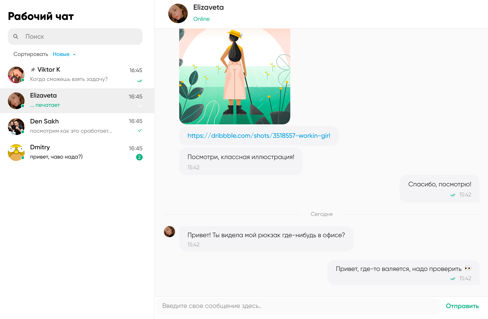

# Тестовое задание: Junior/Middle Node.js (Nest) Backend Developer

## Разработать систему обмена сообщениями

Примерный интерфейс:

Необходима регистрация, авторизация (логин пароль).
Отправлять сообщения можно формой.
Необходим поиск по сообщениям в чате.
Все пользователи видят все чаты, любой пользователь может создать чат.

Фронтенд - делайте как сможете, можете использовать готовый, оценивать будем только backend реализацию.

Отправку и получение сообщений - сделать через Socket.
Обязательно учесть возможность передавать через чат файлы.

**Стэк**: на ваше усмотрение
**Адаптивность**: Не обязательна

**Создать readme.md файл с описанием запуска проекта**