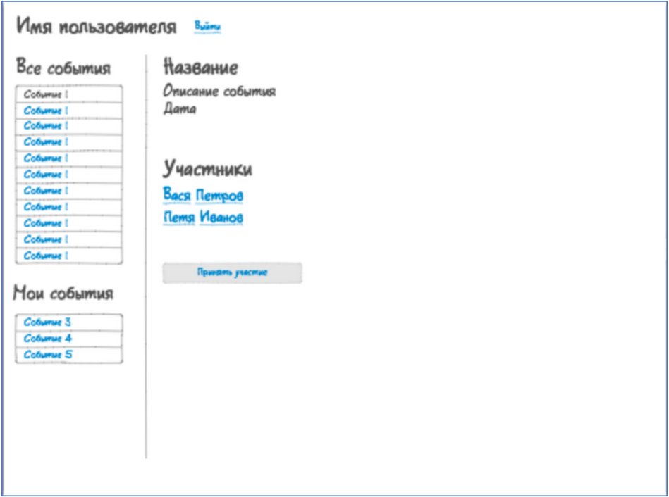

# Тестовое задание: Backend developer

## Предлагаем Вашему вниманию тестовое задание на вакансию Backend developer. Задание должно быть выполнено на PHP + Laravel.

1. Необходимо создать БД под управлением MySQL со следующими сущностями:
    * Пользователь (Все поля, кроме 'Дата рождения' не могут принимать нулевые значения):
      * id;
      * Логин;
      * Пароль;
      * Имя;
      * Фамилия;
      * Дата регистрации;
      * Дата рождения.    
    * Event (Все значения ненулевые)
      * id;
      * Заголовок;
      * Текст;
      * Дата создания;
      * Создатель (сущность Пользователь);
      * Участники (сущность Пользователи).
2. Разработать RESTful API для:
    * регистрация пользователя;
    * авторизация пользователя;
    * создание события;
    * получение списка событий;
    * участие в событии;
    * отмена участия в событии;
    * удаление события создателем.
    * Ответ с сервера должен приходить в виде такого JSON: ```{"error":null,
"result":{"id":1, "first_name":"Вася", "last_name":"Петров"}}```.
3. Создать простую админку, используя AdminLTE:
    * регистрация пользователя;
    * авторизация пользователя;
    * список событий;
    * информация о пользователе.

Если в процессе регистрации или авторизации произошла ошибка, необходимо показать диалоговое окно с описанием ошибки. При успешной регистрации или авторизации открывается окно со списком событий (см. скрин).

При просмотре НЕ своего события внизу находится кнопка "Принять участие", при просмотре своего события - кнопка "Отказаться от участия" Элементы "Все события" и "Участники" должны обновляться каждые 30 секунд, по возможности, без перезагрузки страницы.

При клике на участника показывается экран информации об участнике в произвольном виде.

Макет внешнего вида:
